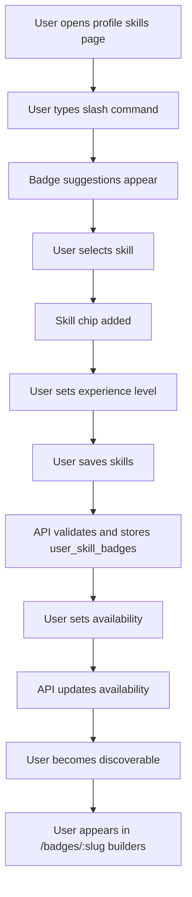

## 1. Scenario

A user (builder/helper) adds skill badges to their profile (e.g., React, FastAPI, Backend) and sets availability. These selections determine whether they appear on:

* `/badges/:slug` → Builders tab
* search results
* recommendation modules

## 2. Goal

Create a structured, filterable talent layer so:

* builders can be discovered by skill
* clients can quickly find relevant help
* badge pages (Scenario 3) show accurate “available builders”

## 3. Trigger

* User opens profile for first time (onboarding)
* User edits profile later
* User clicks “Add Skills” or “Set Availability”
* System prompts user when trying to apply to jobs without skills set

## 4. Actors

* Builder (user)
* System
* Admin (optional moderation)

## 5. Frontend Route Paths

* `/profile/edit`
* `/profile/skills`
* `/profile/availability`
* `/profile/:username` (public view)

## 6. UX Flow

### Entry Flow A — Add skills (slash-like picker reused)

1. User opens `/profile/skills`
2. Sees input: “Add your skills (type / to search)”
3. User types `/react`
4. Dropdown suggestions appear
5. User selects React → chip added
6. User repeats for:

   * `/fastapi`
   * `/backend`
7. Each chip optionally expands to set:

   * experience level (Beginner / Intermediate / Advanced / Expert)
   * years experience
   * featured toggle
8. User clicks `Save Skills`

### Entry Flow B — Set availability

1. User opens `/profile/availability`
2. Toggles:

   * Available for work: ON/OFF
   * Availability type:

     * Open now
     * Part-time
     * Project-based
3. Optional inputs:

   * rate (optional MVP)
   * response time
4. Clicks `Save`

### Entry Flow C — Auto-prompt

1. User tries to:

   * apply to a job
   * post availability
2. System detects:

   * no skills OR no availability set
3. Modal:

   * “Add at least 1 skill and set availability to appear in searches”
4. Redirect to `/profile/skills`

## 7. Backend Routing Flow

### Get badge suggestions (reuse Scenario 2)

* `GET /api/badges/suggest?q=rea&type=tool`

### Save user skills

* `POST /api/users/me/skills`

```json
{
  "skills": [
    {
      "badge_slug": "react",
      "experience_level": "advanced",
      "years_experience": 3
    },
    {
      "badge_slug": "fastapi",
      "experience_level": "intermediate"
    }
  ]
}
```

### Update availability

* `PATCH /api/users/me/availability`

```json
{
  "is_available": true,
  "availability_type": "project",
  "response_time_hours": 12
}
```

### Get builders by badge (used in Scenario 3)

* `GET /api/badges/:slug/builders`

## 8. Database Tables Touched

### `user_skill_badges`

```sql
id uuid primary key,
user_id uuid not null references users(id) on delete cascade,
badge_id uuid not null references badges(id) on delete restrict,
experience_level text,
years_experience numeric(4,1),
is_featured boolean default false,
created_at timestamptz default now(),
unique(user_id, badge_id)
```

### `user_availability`

```sql
user_id uuid primary key references users(id) on delete cascade,
is_available boolean not null default false,
availability_type text,         -- open, part_time, project
response_time_hours integer,
updated_at timestamptz default now()
```

### `users` (extend)

```sql
profile_completed boolean default false,
visibility_status text default 'public'
```

## 9. Business Rules

* user must have at least 1 skill to appear in builder listings
* only users with `is_available = true` appear in “available builders”
* inactive badges cannot be added
* duplicate skills not allowed
* max skills (MVP): 10
* experience level optional but recommended
* admins can remove misleading skill claims (future)

## 10. Validation + Guards

* badge must exist and be active
* user must be authenticated
* experience level must match enum
* years_experience must be >= 0
* availability update must be idempotent
* user cannot mark availability if banned/suspended

## 11. System Events / Automations

* `user.skills.updated`
* `user.availability.updated`
* `builder.index.updated` (recompute search index)
* recalculate badge popularity (feeds Scenario 3)

## 12. Ranking Logic (Builders on badge page)

Suggested ranking formula:

```text
builder_score =
  (availability_weight * 5) +
  (completed_jobs * 4) +
  (satisfaction_score * 3) +
  (experience_level_weight * 2) +
  (recent_activity * 2)
```

Where:

* available builders rank above unavailable
* featured skills boost ranking
* recently active users get priority

## 13. UI Components Needed

* `SkillPickerInput` (reuse slash system)
* `SkillBadgeChip`
* `SkillExperienceSelector`
* `UserSkillsEditor`
* `AvailabilityToggle`
* `AvailabilitySelector`
* `BuilderAvailabilityCard`
* `ProfileSkillsSection`
* `BuilderCard` (used in badge pages)

## 14. Profile Display (Public)

### Builder profile should show:

* profile image
* headline
* skill badges (chips)
* experience indicators
* availability badge:

  * `Available`
  * `Busy`
* stats:

  * completed jobs
  * satisfaction score

Example:

* [React] [FastAPI] [Backend]
* Availability: Available
* Completed: 18 jobs
* Rating: 4.9

## 15. Success State

User:

* adds skills
* sets availability

System:

* user appears on:

  * `/badges/react` → Builders tab
  * search results
* profile shows badges and availability clearly

## 16. Failure / Edge States

* no skills → user hidden from builder listings
* availability off → still searchable but marked unavailable OR hidden (product decision)
* badge removed from system → auto-clean skill entry
* user adds too many skills → block with limit message
* stale badge selection → validation error on save

## 17. Recommended Product Decisions

### MVP behavior

* require:

  * ≥1 skill
  * availability ON
* to appear in builder listings

### Visibility logic

Option A (recommended):

* show only available builders by default
* allow toggle “show all builders”

### Skill input UX

* reuse slash command system from Scenario 2
* chips consistent across:

  * messages
  * jobs
  * profiles

## 18. Mermaid Flow Chart



## 19. API Error Contract

```json
{
  "error": "INVALID_SKILL_SELECTION",
  "message": "One or more selected skills are invalid or inactive."
}
```

## 20. GitHub Issue Titles

* `[feature] Add user_skill_badges table`
* `[feature] Add user availability system`
* `[feature] Build profile skills editor with slash picker`
* `[feature] Build availability toggle UI`
* `[feature] Add builders endpoint for badge pages`
* `[feature] Rank builders by availability and experience`
* `[feature] Add skill badges to public profile`

## 21. How This Connects

This completes the loop:

* Scenario 2 → users tag content with badges
* Scenario 3 → users click badges to explore
* Scenario 4 → builders appear in those badge pages

This forms the core **discovery + matching engine** of Cafe.

---

## 22. Suggested Next Scenario

Next highest-leverage flow:

**Scenario 5: User posts a job with required badges and budget, and it auto-matches recommended builders**

That’s where this system turns into real marketplace conversion.
