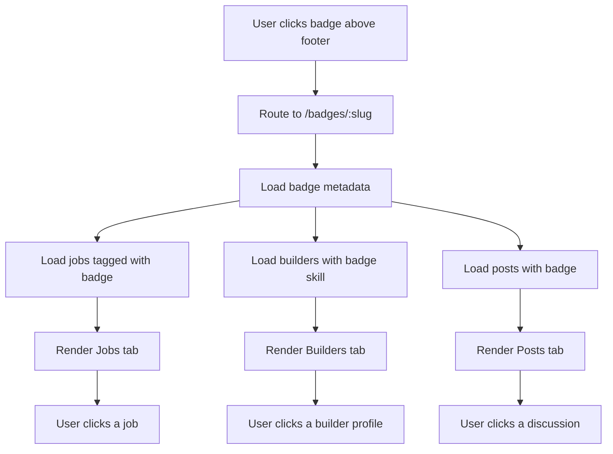

# Scenario: Global badge rail opens filtered jobs and builder availability

## 1. Scenario

At the bottom of the page, just above the footer, the app shows a badge directory containing badges from all major categories.

Badges are ordered by popularity:

* most commonly selected first
* less-used badges after

When a user clicks a badge such as `React`, the app opens a dedicated badge page showing:

* jobs tagged with React
* builders/helpers who list React as a skill
* optionally related project posts and discussions

## 2. Goal

Turn badges into a discovery and routing system so users can move directly from interest or skill area into relevant marketplace activity.

This creates:

* faster job discovery
* faster builder discovery
* stronger matching between task demand and user expertise
* SEO-friendly topic pages later

## 3. Trigger

Flow starts when a user:

* clicks a badge from the bottom-of-page badge section
* clicks a badge chip inside a message or project
* searches a badge from a badge directory page

## 4. Actors

* Visitor
* Logged-in user
* Builder
* Client / project owner
* System

## 5. Frontend Route Paths

### Global badge routes

* `/badges`
* `/badges/:badgeSlug`

### Example

* `/badges/react`
* `/badges/fastapi`
* `/badges/frontend`
* `/badges/database`

### Optional filtered subroutes

* `/badges/:badgeSlug/jobs`
* `/badges/:badgeSlug/builders`
* `/badges/:badgeSlug/posts`

## 6. UX Flow

### Entry Flow A — Footer-adjacent badge rail

1. User scrolls near bottom of page
2. Above footer is a section like `Browse By Skills & Categories`
3. Badge chips are shown sorted by popularity
4. User clicks `React`
5. System routes to `/badges/react`

### Entry Flow B — Badge landing page

1. Badge page loads with badge hero/header
2. User sees:

   * badge name
   * badge type
   * number of matching jobs
   * number of matching builders
   * related badges
3. Tabs or sections appear:

   * Jobs
   * Builders Available
   * Posts / Discussions
4. Jobs listed first by default
5. User can switch to builder availability tab
6. User can refine by filters

### Entry Flow C — Builder discovery

1. User clicks `React`
2. Opens React landing page
3. User scans builder cards tagged with React expertise
4. User clicks profile
5. User can message builder or view availability

## 7. Page Layout Recommendation

## Bottom Badge Section

Place above footer on:

* homepage
* project discovery page
* message board
* possibly dashboard

Section title:

* `Browse Popular Skills`
* or `Explore by Badge`

Display:

* badge chip
* count
* maybe mini icon

Order:

* highest usage first
* then descending

Example:

* React (184)
* Frontend (173)
* FastAPI (121)
* Backend (118)
* Database (96)

## Badge Landing Page Layout

Recommended blocks:

1. Badge header
2. Stats strip
3. Jobs tab
4. Builders Available tab
5. Related discussions/posts
6. Related badges
7. CTA buttons

Example header:

* `React`
* `Tool Badge`
* `128 open jobs • 64 builders available`

## 8. Backend Routing Flow

### Get popular badges for bottom section

* `GET /api/badges/popular?limit=30`

Returns badges ranked by usage across:

* jobs
* user skills
* messages/posts
* projects

### Get badge landing page summary

* `GET /api/badges/:slug`

Returns:

* badge metadata
* total counts
* related badges

### Get jobs for a badge

* `GET /api/badges/:slug/jobs`

### Get builders for a badge

* `GET /api/badges/:slug/builders`

### Get posts/discussions for a badge

* `GET /api/badges/:slug/posts`

## Example response

```json
{
  "badge": {
    "slug": "react",
    "label": "React",
    "badge_type": "tool"
  },
  "counts": {
    "jobs": 128,
    "builders": 64,
    "posts": 210
  },
  "related_badges": [
    "frontend",
    "typescript",
    "nextjs"
  ]
}
```

## 9. Suggested Database Tables Touched

Existing or implied tables:

### `badges`

Master badge library

```sql
id uuid primary key,
badge_type text not null,
slug text not null unique,
label text not null,
description text null,
is_active boolean not null default true,
sort_order integer not null default 0,
created_at timestamptz not null default now()
```

### `jobs`

Jobs posted by users

```sql
id uuid primary key,
owner_id uuid not null references users(id),
title text not null,
description text not null,
status text not null,
created_at timestamptz not null default now()
```

### `job_badges`

```sql
id uuid primary key,
job_id uuid not null references jobs(id) on delete cascade,
badge_id uuid not null references badges(id) on delete restrict,
unique(job_id, badge_id)
```

### `user_skill_badges`

For builder skill profiles

```sql
id uuid primary key,
user_id uuid not null references users(id) on delete cascade,
badge_id uuid not null references badges(id) on delete restrict,
experience_level text null,
years_experience numeric(4,1) null,
is_featured boolean not null default false,
unique(user_id, badge_id)
```

### `message_badges`

From Scenario 2

```sql
id uuid primary key,
message_id uuid not null references messages(id) on delete cascade,
badge_id uuid not null references badges(id) on delete restrict,
unique(message_id, badge_id)
```

### Optional: `badge_stats_daily`

Precomputed popularity counts

```sql
badge_id uuid not null references badges(id),
stat_date date not null,
jobs_count integer not null default 0,
builders_count integer not null default 0,
posts_count integer not null default 0,
total_score integer not null default 0,
primary key (badge_id, stat_date)
```

## 10. Business Rules

* only active badges appear in public badge rail
* popularity sorting should be based on actual usage
* one badge page aggregates multiple content types
* jobs shown must currently be open/active
* builders shown must have public profiles and opted-in availability if required
* private or hidden profiles do not appear
* banned or suspended users do not appear
* badges with zero public results may still exist, but should be hidden from popular rail unless intentionally shown

## 11. Popularity Ranking Logic

Recommended weighted score:

```text
badge_score =
  (job_usage * 5) +
  (builder_skill_usage * 4) +
  (project_usage * 3) +
  (message_usage * 1)
```

This is better than raw message count because job and skill usage are more meaningful for marketplace discovery.

## 12. Validation + Guards

* badge slug must exist
* inactive badge slug returns 404 or hidden result
* only public/open records are included
* filters must only allow approved values
* stale badge count should not break page rendering

## 13. Filtering Options On Badge Page

### Jobs tab filters

* open now
* budget range
* remote/on-platform
* experience level
* newest
* highest paying

### Builders tab filters

* availability now
* satisfaction score
* completed side jobs
* experience level
* hourly or per-task preference
* verified account
* location optional if enabled later

### Posts tab filters

* newest
* most discussed
* project posts only
* message board only

## 14. UI Components Needed

### Bottom-of-page section

* `PopularBadgeRail`
* `BadgeCategoryCluster`
* `BadgeChipLink`
* `BadgeCountPill`

### Badge landing page

* `BadgeHero`
* `BadgeStatsStrip`
* `BadgeContentTabs`
* `BadgeJobsList`
* `BadgeBuildersList`
* `BadgePostsList`
* `RelatedBadgesPanel`
* `BuilderAvailabilityCard`
* `JobCard`
* `EmptyBadgeState`

## 15. Recommended UX Behavior

### Bottom section behavior

Show grouped but still popularity-sorted badges.

Example display:

* Tools: React, FastAPI, PostgreSQL, GraphQL
* Categories: Frontend, Backend, Database, Design
* Roles: Builder, Designer, API Dev

Alternative:

* one unified stream sorted by popularity
* small category label on each chip

Best option for MVP:

* unified list sorted by popularity
* chip includes subtle type indicator
* clicking always goes to badge landing page

## 16. Success State

User clicks `React` and reaches a page that clearly shows:

* React-related jobs
* React-skilled builders
* React-tagged posts/discussions
* ways to message, apply, or explore further

## 17. Failure / Edge States

* badge exists but no current jobs → show builder results and empty jobs state
* badge exists but no public builders → show jobs and empty builders state
* badge removed/inactive → 404 or redirected to `/badges`
* counts out of sync → show live results even if header count is cached
* user clicks badge with low/no activity → page still renders with empty-state CTA

## 18. Suggested Empty States

### No jobs

`No open React jobs right now.`
CTA:

* `Browse React builders`
* `Create a React job`

### No builders

`No builders currently marked available for React.`
CTA:

* `Browse React jobs`
* `View related badges`

### No posts

`No recent React discussions yet.`
CTA:

* `Start a discussion`

## 19. Mermaid Flow Chart



## 20. Recommended API Contracts

### Popular badges

```json
[
  {
    "slug": "react",
    "label": "React",
    "badge_type": "tool",
    "total_score": 184,
    "jobs_count": 41,
    "builders_count": 26
  }
]
```

### Builders for badge

```json
{
  "items": [
    {
      "user_id": "usr_123",
      "display_name": "Nick B",
      "headline": "Frontend + API builder",
      "completed_jobs": 18,
      "satisfaction_score": 4.9,
      "availability_status": "available",
      "matched_badges": ["react", "frontend"]
    }
  ]
}
```

## 21. GitHub Issue Titles

* `[feature] Add popular badge rail above footer`
* `[feature] Build badge landing page route`
* `[feature] Add badge-filtered jobs endpoint`
* `[feature] Add badge-filtered builders endpoint`
* `[feature] Add badge-filtered posts endpoint`
* `[feature] Add user skill badges table`
* `[feature] Add job badges join table`
* `[feature] Create weighted popularity ranking for badges`

## 22. Product Decision Recommendation

Best product behavior:

* make badges both descriptive and navigational
* use them as one of the primary marketplace routing systems
* show jobs and builders on the same badge page
* default to `Jobs` first, `Builders` second
* place the badge rail above footer sitewide where discovery matters

This connects Scenario 2 directly into marketplace discovery.

## 23. Suggested next linked scenario

The logical next one is:
**Scenario 4: Builder adds skill badges to profile and marks availability so they appear on badge landing pages**
