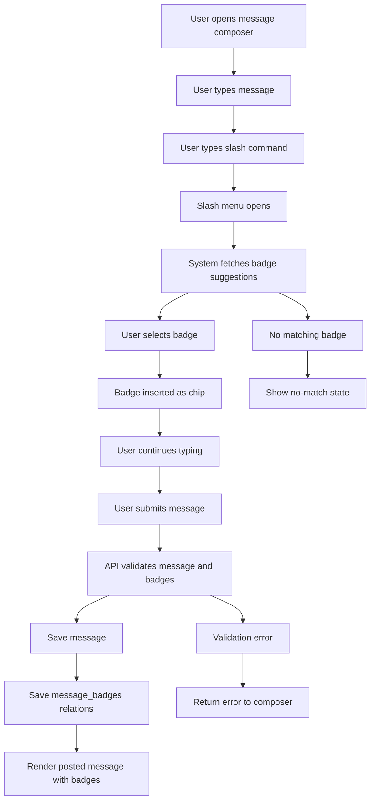

# Scenario 2: User adds category/tool badges in messages with slash command

## 1. Scenario

A user posts a message on:

* the message board
* a project post
* project comments
* discussion threads

They want to quickly tag the message with category or tool badges by typing `/` and selecting or completing a badge name such as:

* react
* fastapi
* frontend
* backend
* database

## 2. Goal

Let users tag messages quickly without leaving the editor, so posts become:

* easier to filter
* easier to search
* clearer about tech stack and topic
* more structured without forcing a complex form

## 3. Trigger

Flow starts when user:

* creates a new message
* replies to a thread
* comments on a project
* edits an existing message

## 4. Actors

* User
* System
* Moderator/Admin

## 5. Frontend Route Paths

Examples:

* `/board`
* `/board/new`
* `/projects/:projectId`
* `/projects/:projectId/posts`
* `/projects/:projectId/discussions/:discussionId`
* `/messages/:messageId/edit`

## 6. UX Flow

### Entry Flow A — New message with slash badge

1. User opens message composer
2. User types normal message text
3. User types `/`
4. Slash-command menu opens inline near cursor
5. User types badge text after slash, such as `/rea`
6. System shows matching suggestions:

   * React
   * React Native
   * Realtime
7. User selects one or more badges
8. Selected badge is inserted into message composer as a token/chip
9. User continues typing
10. User submits message
11. Message is saved with structured badge metadata

### Entry Flow B — Add multiple badges

1. User writes message
2. Types `/frontend`
3. Badge chip inserted
4. Types another slash command `/fastapi`
5. Badge chip inserted
6. Submits message with multiple tags attached

### Entry Flow C — Free text plus auto-convert

1. User types `/backend`
2. On space, enter, or selection, system converts text into a badge chip
3. Badge becomes removable/editable before submit

### Entry Flow D — Unknown badge

1. User types `/somecustomthing`
2. No exact match found
3. Depending on product rule:

   * show “No match found”
   * allow creation request
   * or block non-approved badges
4. User either selects a valid badge or posts without it

## 7. Backend Routing Flow

### Fetch badge suggestions

* `GET /api/badges/suggest?q=rea&type=tool`
* returns matching badges

### Validate selected badges at submit

* `POST /api/messages`
* payload includes message body and badge ids/slugs

Example:

```json
{
  "context_type": "project_post",
  "context_id": "proj_123",
  "body": "Need help building the API layer and UI cleanup",
  "badge_slugs": ["react", "fastapi", "frontend", "backend"]
}
```

### Update existing message

* `PATCH /api/messages/:id`
* body can update:

  * message text
  * attached badges

### Search/filter messages by badge

* `GET /api/messages?badge=react`
* `GET /api/projects/:id/posts?badge=backend`

## 8. Suggested Database Tables Touched

### `messages`

```sql
id uuid primary key,
author_id uuid not null references users(id),
context_type text not null,       -- board, project, discussion, comment
context_id uuid not null,
body text not null,
body_rich jsonb null,
created_at timestamptz not null default now(),
updated_at timestamptz not null default now(),
deleted_at timestamptz null
```

### `badges`

Central controlled badge library

```sql
id uuid primary key,
badge_type text not null,         -- tool, category, role, skill
slug text not null unique,
label text not null,
description text null,
icon text null,
color_token text null,
is_active boolean not null default true,
is_system boolean not null default false,
sort_order integer not null default 0,
created_at timestamptz not null default now()
```

### `message_badges`

Join table between messages and badges

```sql
id uuid primary key,
message_id uuid not null references messages(id) on delete cascade,
badge_id uuid not null references badges(id) on delete restrict,
created_at timestamptz not null default now(),
unique(message_id, badge_id)
```

### Optional: `badge_aliases`

For shorthand and fuzzy matching

```sql
id uuid primary key,
badge_id uuid not null references badges(id) on delete cascade,
alias text not null unique
```

## 9. Business Rules

* badges should come from a controlled library in MVP
* one message can have many badges
* duplicate badges on one message are not allowed
* slash command should support both tools and categories
* inactive badges cannot be attached to new messages
* editing a message can update its badges
* moderators can remove invalid or misleading badge usage

## 10. Validation + Guards

* user must be authenticated to post
* message body cannot be empty
* badge slug must map to an active badge
* invalid slash text should not break posting
* duplicate badge selection should collapse to one
* max badge count per message should be enforced, example:

  * 5 badges max in MVP
* badge type restrictions can apply by context if needed

## 11. Suggested Badge Types

For Cafe, initial badge groups should be:

* `tool` → React, FastAPI, PostgreSQL, GraphQL, Canva
* `category` → Frontend, Backend, Database, Design, API
* `role` → Builder, Helper, Designer, Analyst
* `task_type` → Bug, Feature, Content, Setup, Review

## 12. Slash Command Parsing Logic

### Frontend parsing behavior

When user types:

```text
Need help with auth cleanup /react /frontend /fastapi
```

Frontend should:

1. detect `/` token start
2. read characters until:

   * space
   * punctuation break
   * enter
   * suggestion selected
3. query suggestion endpoint
4. replace raw slash text with structured badge chip

### Stored result

Do not rely only on raw message text for badge meaning.
Store:

* visible chip in UI
* normalized badge relation in DB

## 13. UI Components Needed

* `MessageComposer`
* `SlashCommandMenu`
* `BadgeSuggestionList`
* `BadgeChip`
* `ComposerTokenInput`
* `MessageBadgeRow`
* `BadgeFilterBar`
* `ProjectDiscussionComposer`
* `MessageEditModal`

## 14. Recommended UX Behavior

Best MVP behavior:

* slash command opens only for approved badge library
* user sees instant search suggestions
* selecting a badge inserts a chip
* chip has:

  * icon optional
  * label
  * remove x
* free typing remains simple
* no separate “category form” required

Example composer experience:

```text
I can help build the auth routes /fastapi /backend /database
```

Rendered before submit as:

* I can help build the auth routes
* [FastAPI] [Backend] [Database]

## 15. Success State

User submits message successfully and sees:

* message content posted
* selected badges displayed beneath or inline
* message becomes filterable/searchable by badge

## 16. Failure / Edge States

* badge not found → show “No matching badge”
* too many badges → block extra additions
* inactive badge selected from stale UI → reject on submit
* message saved but badge insert fails → return validation error
* pasted raw slash commands with no selection → either parse server-side or ignore as plain text based on rule

## 17. Recommended Product Decision

For MVP:

* allow only approved badges
* do not let users create arbitrary public badges yet
* include alias support so:

  * `/db` maps to Database
  * `/pg` maps to PostgreSQL
  * `/api` maps to API
* support both click selection and keyboard enter
* preserve simple text-post workflow

## 18. Mermaid Flow Chart



## 19. Recommended API Error Contract

```json
{
  "error": "INVALID_BADGE_SELECTION",
  "message": "One or more selected badges are invalid or inactive.",
  "invalid_badges": ["somecustomthing"]
}
```

## 20. GitHub Issue Titles

* `[feature] Create badge library tables`
* `[feature] Add slash-command badge picker to message composer`
* `[feature] Save structured badge relations on messages`
* `[feature] Add badge suggestion API endpoint`
* `[feature] Add message filtering by badge`
* `[feature] Add alias support for slash badge shortcuts`
* `[feature] Add badge chips to project discussions and board posts`

## 21. Recommended next build order

Build this flow in this order:

1. `badges` table
2. `message_badges` join table
3. suggestion endpoint
4. slash-command UI
5. chip rendering
6. filters/search integration

Send Scenario 3.
