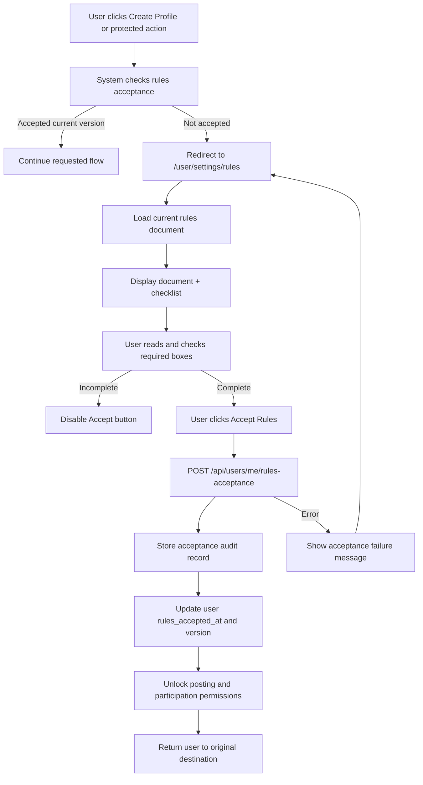

# Scenario 1: User creates profile and must acknowledge rules before participating

## 1. Scenario

User creates a profile but must read and accept the platform Rules and Violations document before they can:

* post jobs
* offer to do jobs
* submit proposals
* accept work

## 2. Goal

Protect the platform and platform owners by requiring explicit acknowledgment of:

* platform rules
* prohibited conduct
* violations and penalties
* liability / responsibility terms
* community standards

## 3. Trigger

This flow can start from either:

* `Create Profile` button
* top-right avatar dropdown
* attempt to post a job
* attempt to offer services / apply to a task

## 4. Actors

* User
* System
* Admin
* Legal / policy content manager

## 5. Frontend Route Paths

Primary route:

* `/user/settings/rules`

Supporting routes:

* `/signup`
* `/profile/create`
* `/jobs/create`
* `/tasks/:id/apply`
* `/offers/create`
* `/user/settings`

## 6. UX Flow

### Entry Flow A — During profile creation

1. User clicks `Create Profile`
2. Account/profile setup begins
3. System checks whether `rules_accepted_at` exists for this user
4. If not accepted, user is redirected to `/user/settings/rules`
5. Rules document page opens
6. User must scroll/read document
7. User checks:

   * `I have read and understand the Rules`
   * `I understand violations may lead to warnings, suspension, or ban`
   * `I agree to follow platform policies`
8. User clicks `Accept Rules`
9. Acceptance record is stored
10. User is returned to profile creation flow
11. Profile creation completes
12. User now has permission to continue onboarding

### Entry Flow B — From top-right avatar dropdown

1. Logged-in user clicks avatar
2. Dropdown shows `User Settings`
3. User selects `Rules & Violations`
4. Route loads `/user/settings/rules`
5. User sees:

   * current acceptance status
   * accepted version number
   * acceptance timestamp
   * button to view current rules
6. If user has not accepted current version, page shows warning banner and locked participation status

### Entry Flow C — Gate before posting or offering work

1. User clicks `Post Job` or `Offer To Help`
2. System checks acceptance status
3. If rules not accepted:

   * block action
   * show modal or redirect notice
   * send user to `/user/settings/rules`
4. After acceptance, user is returned to original action
5. Posting/applying flow resumes

## 7. Backend Routing Flow

### Read current rules document

* `GET /api/rules/current`
* returns:

  * current version
  * title
  * body/html/markdown
  * effective date
  * required acknowledgment fields

### Get user acknowledgment status

* `GET /api/users/me/rules-status`
* returns:

  * has_accepted_current_version
  * accepted_version
  * accepted_at
  * must_reaccept

### Accept rules

* `POST /api/users/me/rules-acceptance`
* payload:

```json
{
  "rules_version": "v1.0",
  "accepted": true,
  "checkboxes": {
    "read_rules": true,
    "understand_violations": true,
    "agree_to_policies": true
  }
}
```

### Gate protected actions

Protected routes check rules acceptance before allowing write actions:

* `POST /api/jobs`
* `POST /api/tasks/:id/apply`
* `POST /api/offers`
* `POST /api/submissions`

If not accepted:

* return `403 RULES_ACCEPTANCE_REQUIRED`

## 8. Suggested Database Tables Touched

### `users`

Add fields:

```sql
rules_accepted_at timestamptz null,
rules_version_accepted text null,
rules_must_reaccept boolean not null default false
```

### `platform_documents`

Stores versioned rules/legal documents

```sql
id uuid primary key,
document_type text not null,         -- rules, violations, terms, safety_policy
version text not null,
title text not null,
body_md text not null,
body_html text null,
is_active boolean not null default true,
effective_at timestamptz not null,
created_at timestamptz not null default now(),
updated_at timestamptz not null default now()
```

### `user_document_acknowledgements`

Audit log for acceptance

```sql
id uuid primary key,
user_id uuid not null references users(id) on delete cascade,
document_id uuid not null references platform_documents(id) on delete restrict,
document_type text not null,
document_version text not null,
accepted_at timestamptz not null default now(),
ip_address inet null,
user_agent text null,
checkboxes jsonb not null default '{}'::jsonb,
created_at timestamptz not null default now()
```

## 9. Business Rules

* user may create an account before accepting rules
* user may not post jobs until current rules are accepted
* user may not offer help or apply to work until current rules are accepted
* if rules version changes, user must re-accept before protected actions continue
* acceptance must be versioned and auditable
* admin can publish new rules version and force re-acknowledgment
* acceptance page must always be reachable from user settings

## 10. Validation + Guards

* user must be authenticated
* active rules document must exist
* all required checkboxes must be true
* accepted version must match current active version
* duplicate acceptance for same version is allowed only as idempotent update or ignored safely
* protected actions must hard-fail if rules not accepted
* banned/suspended users cannot bypass via direct API call

## 11. Notifications / Events

System events to create:

* `rules.accepted`
* `rules.reacceptance_required`
* `rules.version_published`

Possible notifications:

* banner in app: `New rules update requires acknowledgment`
* email for major policy updates
* admin audit log entry when a new version is published

## 12. Success State

User sees:

* `Rules accepted`
* version accepted
* date/time accepted
* participation features unlocked

System state:

* posting jobs enabled
* applying to jobs enabled
* proof that acceptance occurred is stored

## 13. Failure / Edge States

* user closes page before accepting → remains blocked
* current rules version changes during session → prompt re-check
* API submit without acceptance → `403`
* document unavailable → show maintenance error and block protected actions
* partial checkbox completion → disable submit button
* already accepted old version only → show `Re-accept required`

## 14. UI Components Needed

The spec already establishes the Settings page as a home for account-related controls, so this Rules flow fits naturally there. 

Recommended components:

* `UserSettingsDropdownItem`
* `RulesSettingsPage`
* `RulesDocumentViewer`
* `RulesAcceptanceBanner`
* `RulesAcceptanceChecklist`
* `RulesAcceptanceButton`
* `ParticipationLockedNotice`
* `RulesVersionHistoryCard`
* `ProtectedActionGate`
* `ReturnToPreviousActionPrompt`

## 15. Navigation / Dropdown Update

Add to top-right avatar dropdown:

* Profile
* Messages
* My Projects
* My Tasks
* User Settings

  * Account
  * Privacy
  * Connected Accounts
  * Rules & Violations
  * Notifications
  * Billing

## 16. Recommended Product Behavior

Best implementation:

* let users sign up and create a basic profile shell first
* block all marketplace participation until rules are accepted
* keep rules permanently accessible in settings
* store versioned acknowledgment for legal protection
* redirect users back to the interrupted action after acceptance

That is better than forcing the rules only at signup, because users can always revisit them and the system can require re-acceptance later.

## 17. Mermaid Flow Chart



## 18. Recommended API Error Contract

```json
{
  "error": "RULES_ACCEPTANCE_REQUIRED",
  "message": "You must read and accept the current Rules & Violations document before posting or offering services.",
  "redirect_to": "/user/settings/rules"
}
```

## 19. GitHub Issue Titles For This Flow

* `[feature] Add versioned platform rules documents table`
* `[feature] Add user rules acknowledgment audit table`
* `[feature] Build Rules & Violations settings page`
* `[feature] Gate job posting behind rules acceptance`
* `[feature] Gate helper applications behind rules acceptance`
* `[feature] Add avatar dropdown User Settings navigation`
* `[feature] Add protected action redirect after rules acceptance`

Send Scenario 2 and I’ll map it the same way.
