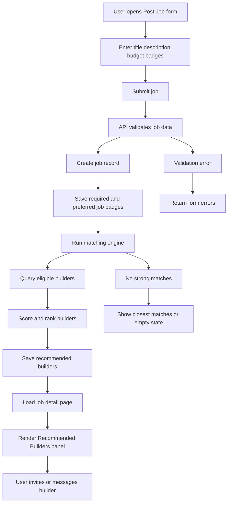

# User posts a job with required badges and budget, then system auto-matches builders

## 1. Scenario

A user posts a job, selects required badges, sets a budget, and the system automatically recommends matching builders based on:

* skill badges
* availability
* experience
* satisfaction score
* completed jobs
* relevance to required tools/categories

## 2. Goal

Reduce friction between job creation and hiring by immediately surfacing relevant builders after the job is posted.

This improves:

* job-to-builder matching
* response speed
* conversion to accepted work
* quality of applicants

## 3. Trigger

Flow begins when a user:

* clicks `Post Job`
* creates a project and adds a job/task
* finishes job setup and submits it live

## 4. Actors

* Job poster / client
* Builder
* System
* Admin/moderation layer

## 5. Frontend Route Paths

* `/jobs/create`
* `/projects/:projectId/jobs/create`
* `/jobs/:jobId`
* `/jobs/:jobId/recommendations`
* `/jobs/:jobId/invite`

## 6. UX Flow

### Entry Flow A — Create the job

1. User clicks `Post Job`
2. Job creation page opens
3. User enters:

   * title
   * description
   * required badges
   * optional preferred badges
   * budget
   * timeline
   * difficulty/experience level
4. User types `/react`, `/fastapi`, `/frontend`
5. Badges appear as chips
6. User sets budget type:

   * fixed
   * hourly
   * credit-based
   * hybrid later if needed
7. User clicks `Post Job`

### Entry Flow B — System processes the job

1. API validates job data
2. Job is created
3. Required badge relations are saved
4. Matching engine runs
5. System scores eligible builders
6. Top recommended builders are attached to the job
7. Job page loads with a `Recommended Builders` panel

### Entry Flow C — Poster reviews recommendations

1. User lands on newly created job page
2. Sees recommended builders immediately
3. Each builder card shows:

   * profile photo
   * headline
   * matching badges
   * rating
   * completed side jobs
   * availability
4. User can:

   * invite builder
   * message builder
   * save builder
   * browse all matches

## 7. Job Creation Form Structure

### Core fields

* Job title
* Description
* Required badges
* Preferred badges
* Budget amount
* Budget type
* Expected timeline
* Experience level needed
* Attachments optional
* Visibility/status

### Suggested badge sections

* Required Skills / Tools
* Optional Nice-to-Have Skills
* Category badges
* Role badges if relevant

Example:

* Required: React, Frontend
* Preferred: FastAPI, API
* Budget: $250 fixed

## 8. Backend Routing Flow

### Create job

* `POST /api/jobs`

Example payload:

```json
{
  "project_id": "proj_123",
  "title": "Need React dashboard cleanup",
  "description": "Looking for someone to improve layout, filters, and API rendering.",
  "required_badge_slugs": ["react", "frontend"],
  "preferred_badge_slugs": ["fastapi", "api"],
  "budget_type": "fixed",
  "budget_amount": 250,
  "timeline_days": 5,
  "experience_level_required": "intermediate"
}
```

### Create matching recommendations

Called internally after successful job creation:

* `POST /api/jobs/:jobId/generate-matches`

or handled asynchronously inside service layer, but the first result set should still be returned to UI on create if feasible.

### Fetch recommended builders

* `GET /api/jobs/:jobId/recommended-builders`

### Invite a builder

* `POST /api/jobs/:jobId/invitations`

## 9. Suggested Database Tables Touched

### `jobs`

```sql
id uuid primary key,
project_id uuid null references projects(id),
owner_id uuid not null references users(id),
title text not null,
description text not null,
budget_type text not null,              -- fixed, hourly, credits
budget_amount numeric(10,2) not null,
timeline_days integer null,
experience_level_required text null,
status text not null default 'open',
created_at timestamptz not null default now(),
updated_at timestamptz not null default now()
```

### `job_badges`

```sql
id uuid primary key,
job_id uuid not null references jobs(id) on delete cascade,
badge_id uuid not null references badges(id) on delete restrict,
badge_requirement_type text not null,   -- required, preferred
created_at timestamptz not null default now(),
unique(job_id, badge_id, badge_requirement_type)
```

### `job_recommended_builders`

```sql
id uuid primary key,
job_id uuid not null references jobs(id) on delete cascade,
user_id uuid not null references users(id) on delete cascade,
match_score numeric(8,4) not null,
match_reason jsonb not null default '{}'::jsonb,
rank_position integer not null,
created_at timestamptz not null default now(),
unique(job_id, user_id)
```

### `job_invitations`

```sql
id uuid primary key,
job_id uuid not null references jobs(id) on delete cascade,
sender_user_id uuid not null references users(id),
recipient_user_id uuid not null references users(id),
status text not null default 'pending',   -- pending, viewed, accepted, declined, expired
message text null,
created_at timestamptz not null default now(),
responded_at timestamptz null
```

### Reused tables

* `users`
* `user_skill_badges`
* `user_availability`
* `badges`

## 10. Business Rules

* job must include at least 1 required badge in MVP
* only active badges can be attached
* budget must be valid and positive
* only builders with public profiles and valid standing can be recommended
* recommended builders should exclude banned/suspended users
* poster should not see themselves as a recommendation
* builders with matching required badges rank above partial matches
* unavailable builders may be excluded or shown lower depending on product rule

## 11. Validation + Guards

* user must be authenticated
* user must have accepted rules before posting
* job title and description required
* budget amount must be greater than zero
* budget type must match enum
* duplicate badges collapse into one relation
* required and preferred badges should not duplicate
* job cannot be posted if account is suspended or restricted

## 12. Matching Engine Logic

### Required inputs

* job required badges
* job preferred badges
* budget
* experience level required
* builder skill badges
* builder availability
* builder stats

### Recommended base scoring model

```text
match_score =
  (required_badge_match * 50) +
  (preferred_badge_match * 20) +
  (availability_score * 20) +
  (experience_alignment * 15) +
  (completed_jobs_score * 10) +
  (satisfaction_score * 10) +
  (recent_activity_score * 5)
```

### Example weighting details

* exact required badge overlap: very high weight
* preferred badge overlap: medium weight
* currently available: strong boost
* profile completion: small boost
* recent response/activity: small boost

### Hard filters before scoring

Exclude builders who:

* are unavailable if strict availability mode is enabled
* do not meet minimum required badge threshold
* are suspended/banned
* have private/non-public builder profiles
* have blocked the poster or vice versa if supported later

## 13. Matching Threshold Options

### Strict mode

Recommend only builders who match all required badges.

### Flexible mode

Recommend builders who match most required badges and rank them by score.

### Best MVP choice

Use flexible mode with:

* all exact matches first
* near matches after
* clear explanation labels

## 14. Match Reason Output

Each recommended builder should include why they matched.

Example:

```json
{
  "matched_required_badges": ["react", "frontend"],
  "matched_preferred_badges": ["fastapi"],
  "availability": "available",
  "experience_level": "advanced",
  "completed_jobs": 18,
  "rating": 4.9
}
```

This helps the poster trust the recommendation.

## 15. UI Components Needed

* `JobCreateForm`
* `JobBadgePicker`
* `BudgetSelector`
* `TimelineSelector`
* `RecommendedBuildersPanel`
* `RecommendedBuilderCard`
* `MatchReasonPills`
* `InviteBuilderButton`
* `MessageBuilderButton`
* `BrowseAllMatchesModal`

## 16. Recommended Job Page Behavior

After posting, the job detail page should show:

### Main column

* title
* description
* required badges
* preferred badges
* budget
* timeline
* apply CTA

### Side panel or priority section

* `Recommended Builders`
* top 3 to 8 builders
* option to view all matches

This should happen immediately after posting to create momentum.

## 17. Success State

User posts a job and sees:

* job is live
* required badges displayed
* budget shown
* recommended builders listed instantly
* option to invite/message builders

System state:

* job stored
* job badge links stored
* recommendations generated
* builder ranking saved

## 18. Failure / Edge States

* no builders match all required badges → show closest matches
* no builders match at all → show empty state + suggest widening badges
* invalid badge selected → block submit
* budget missing or invalid → validation error
* stale badge removed before submit → reject and refresh badge options
* recommendations service fails → job still posts, recommendation panel shows retry state

## 19. Suggested Empty States

### No exact matches

`No builders match every required badge yet.`
Show:

* closest matches
* edit job badges
* browse badge pages

### No matches at all

`No builders found for this combination right now.`
CTA:

* broaden required skills
* lower strictness
* post publicly and accept applications

## 20. Invite Flow Connection

After auto-match, user should be able to:

* invite selected builders directly
* send a short intro note
* optionally offer priority response incentive later

Example invite flow:

1. User clicks `Invite`
2. Modal opens
3. Adds short message
4. Sends invitation
5. Builder gets notification and inbox item

## 21. Notifications / Events

System events:

* `job.created`
* `job.matches.generated`
* `job.invitation.sent`

User-facing notifications:

* poster sees “Recommended builders ready”
* invited builders receive:

  * in-app notification
  * email optional later

## 22. Mermaid Flow Chart



## 23. Recommended API Error Contract

```json
{
  "error": "INVALID_JOB_POST",
  "message": "Your job could not be posted because one or more required fields are invalid.",
  "fields": {
    "budget_amount": "Must be greater than zero",
    "required_badges": "Select at least one required badge"
  }
}
```

## 24. GitHub Issue Titles

* `[feature] Build job creation form with required badges and budget`
* `[feature] Add job_badges table with required/preferred types`
* `[feature] Build job recommendation engine`
* `[feature] Add job_recommended_builders table`
* `[feature] Show recommended builders after job creation`
* `[feature] Add builder invitation flow from job page`
* `[feature] Add match reason metadata to recommendations`

## 25. Product Decision Recommendation

Best MVP approach:

* require at least 1 required badge
* generate recommendations immediately after job creation
* show top exact matches first
* allow near matches if exact pool is small
* explain each recommendation with clear match reasons
* let poster invite builders directly from the recommendation panel

This is the first full marketplace conversion loop:

* builders define skills
* jobs define needs
* badges connect both
* matching produces action

## 26. Logical Next Scenario

**Scenario 6: Builder receives a job invitation, reviews the job, accepts or declines, and starts a work thread**
