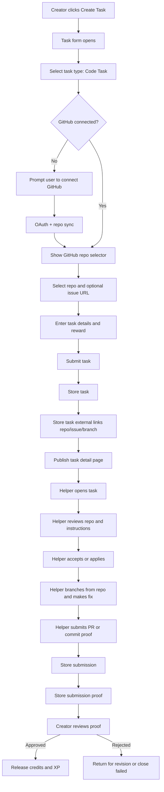

# Scenario 3: User posts a task that another person completes through GitHub

## 1. Scenario

A user posts a task that requires work inside a GitHub repository so another person can branch from the codebase, make changes, and submit a fix.

## 2. Goal

Let task creators connect a GitHub repo to the task so helpers can:

* understand the exact codebase
* see the problem to solve
* create a branch
* submit work through PR / commit proof
* let the creator review and approve the work

## 3. Trigger

This flow starts when a user:

* creates a new task under a project
* edits an existing task and marks it as code-related
* attaches a GitHub repo during task creation

## 4. Actors

* Task Creator / Builder
* Helper / Worker
* System
* GitHub
* Reviewer
* Admin

## 5. Frontend Route Paths

Primary routes:

* `/projects/:projectId/tasks/create`
* `/tasks/:taskId`
* `/tasks/:taskId/apply`
* `/tasks/:taskId/workspace`
* `/submissions/:submissionId/review`

Supporting routes:

* `/user/settings/integrations`
* `/user/settings/github`
* `/projects/:projectId`

## 6. UX Flow

### Entry Flow A — Creator posts a GitHub-based task

1. User clicks `Create Task`
2. Task form opens
3. User selects task type:

   * general task
   * design task
   * code task
4. If `code task` is selected, GitHub section appears
5. User chooses:

   * connect GitHub if not already connected
   * select synced repo
   * optionally attach issue URL
   * optionally add target branch
   * optionally add branch naming rule
6. User enters:

   * task title
   * problem description
   * expected fix
   * tech stack
   * acceptance criteria
   * reward / credits / tip
7. User submits task
8. Task detail page shows linked repo and GitHub work instructions

### Entry Flow B — Helper accepts task

1. Helper opens task detail page
2. Helper sees:

   * repo card
   * issue link if present
   * default branch
   * expected deliverable
   * branch naming instructions
3. Helper clicks `Accept Task` or `Apply`
4. System validates eligibility
5. Task moves into in-progress state or application review state
6. Helper sees work instructions panel:

   * clone/fork guidance
   * create branch
   * fix issue
   * submit PR URL or commit URL

### Entry Flow C — Helper submits fix

1. Helper completes work in GitHub
2. Helper opens Cafe submission form
3. Helper enters:

   * PR URL
   * commit URL
   * branch name
   * optional note
   * optional demo / screenshot / file
4. User submits work
5. System stores proof
6. Creator reviews fix
7. Creator approves or rejects
8. If approved, credits release and XP updates

## 7. Backend Routing Flow

### GitHub connect and repo sync

* `POST /api/integrations/github/connect`
* `GET /api/integrations/github/callback`
* `POST /api/integrations/github/repos/sync`
* `GET /api/integrations/github/repos`

### Create task with GitHub linkage

Suggested task creation route:

* `POST /api/projects/:projectId/tasks`

Suggested payload:

```json
{
  "title": "Fix navbar mobile bug",
  "description": "Dropdown overlaps content on mobile Safari",
  "task_type": "code_task",
  "reward_credits": 25,
  "acceptance_criteria": [
    "Navbar closes correctly",
    "No layout overlap",
    "Works on iPhone width"
  ],
  "github": {
    "repo_id": "internal-repo-uuid",
    "repo_url": "https://github.com/org/repo",
    "issue_url": "https://github.com/org/repo/issues/42",
    "target_branch": "main",
    "branch_prefix": "cafe/task-123-"
  }
}
```

### Store GitHub links on task

After task is created:

* `POST /api/tasks/:taskId/external-links`

  * link_type: `repo`
  * link_type: `issue`
  * optional link_type: `branch`

### Read task with GitHub context

* `GET /api/tasks/:taskId`
* `GET /api/tasks/:taskId/external-links`

### Accept / claim task

Suggested:

* `POST /api/tasks/:taskId/claim`
  or
* `POST /api/tasks/:taskId/apply`

### Submit GitHub work proof

Suggested submission flow:

* `POST /api/tasks/:taskId/submissions`
* `POST /api/submissions/:submissionId/proofs`

Proof types:

* `github_pr`
* `github_commit`
* `github_issue`
* `external_link`
* `file_upload`

### Review outcome

Suggested:

* `POST /api/submissions/:submissionId/approve`
* `POST /api/submissions/:submissionId/reject`

## 8. Database Tables Touched

Core tables already aligned to this flow:

* `users`
* `connected_accounts`
* `github_repositories`
* `projects`
* `tasks`
* `project_links`
* `task_external_links`
* `submissions`
* `submission_proofs`

### Critical table usage

`connected_accounts`

* confirms GitHub is linked

`github_repositories`

* stores synced repos available for attachment

`project_links`

* stores repo at project level if project itself is tied to a repo

`task_external_links`

* stores specific task-level GitHub links:

  * repo
  * issue
  * branch
  * PR
  * commit

`submission_proofs`

* stores final proof URLs for creator review

## 9. Recommended Data Model Additions

To make this workflow cleaner, add these fields to `tasks`:

```sql
task_type text not null default 'general',
requires_github boolean not null default false,
target_branch text null,
branch_name_pattern text null,
repo_required boolean not null default false
```

Optional on `submissions`:

```sql
branch_name text null,
submission_status text not null default 'pending_review'
```

## 10. Business Rules

* only task creator can attach repo during task creation
* only connected GitHub repos owned or accessible by creator can be attached
* task may exist without GitHub unless `requires_github = true`
* a code task should strongly prefer one linked repo
* issue URL is optional for MVP
* branch name should be suggested, not enforced, in MVP
* helper can submit multiple proof links
* approval should not happen without at least one proof for GitHub-based tasks
* private repos should be out of MVP unless permissions are expanded carefully

## 11. Validation + Guards

* auth required
* rules accepted required
* creator must own the project
* repo URL must be valid GitHub domain
* attached repo must exist in synced repo list if selected internally
* issue URL must belong to same repo if strict mode enabled
* task cannot be marked `code_task` with `requires_github = true` and no repo attached
* helper cannot submit review with empty PR/commit proof for GitHub tasks
* only task creator or authorized reviewer can approve submission
* suspended users blocked from task posting and task acceptance

## 12. Success State

Creator sees:

* task published with repo linked
* helper can view exact repo context
* review page contains PR/commit proof

Helper sees:

* clear repo to work from
* branch suggestion
* submission accepted successfully

System sees:

* repo-task relationship stored
* proof-of-work auditable
* approval path tied to actual GitHub artifact

## 13. Failure / Edge States

* creator has not connected GitHub
* repo sync stale or empty
* creator pastes invalid repo URL
* issue URL belongs to a different repo
* helper submits broken PR link
* PR exists but is private or inaccessible
* repo renamed after task creation
* branch deleted before review
* helper submits code proof for wrong task
* creator rejects fix and requests revision

## 14. UI Components Needed

* `CreateTaskForm`
* `TaskTypeSelector`
* `GitHubConnectPrompt`
* `GitHubRepoSelector`
* `GitHubIssueInput`
* `RepoPreviewCard`
* `TaskExternalLinks`
* `GitHubWorkInstructionsCard`
* `BranchNamingNotice`
* `SubmitGitHubProofForm`
* `SubmissionProofUploader`
* `ReviewProofPanel`

## 15. Recommended Product Behavior

Best MVP path:

* creator connects GitHub
* creator syncs repos
* creator selects one repo during task creation
* creator optionally pastes issue URL
* helper works outside Cafe in GitHub
* helper returns PR URL / commit URL as proof
* creator reviews inside Cafe

Do not try to create branches or push commits from inside Cafe in MVP. Keep Cafe as:

* task coordination layer
* repo/task linking layer
* submission proof layer
* approval/payment layer

That is much safer and much faster to ship.

## 16. Mermaid Flow Chart



## 17. Recommended API Error Contract

```json
{
  "error": "GITHUB_REPO_REQUIRED",
  "message": "This task requires a linked GitHub repository before it can be published.",
  "redirect_to": "/user/settings/github"
}
```

## 18. GitHub Issue Titles For This Flow

* `[feature] Add code task type with GitHub repo linkage`
* `[feature] Build GitHub repo selector in task creation`
* `[feature] Add task-level repo/issue/branch link support`
* `[feature] Build helper GitHub work instructions panel`
* `[feature] Add PR and commit proof submission flow`
* `[feature] Add creator review flow for GitHub-based submissions`
* `[feature] Add validation for repo and issue URL matching`

## 19. One Important Design Decision

You need to choose between these two routing models:

**Option A: Link existing GitHub repo only**

* fastest MVP
* safest
* lowest complexity

**Option B: Cafe actively creates GitHub branches/issues**

* much better automation
* requires broader GitHub scopes
* much more complex permissions and failure handling

For MVP, Option A is the correct move.

Send Scenario 4 and I’ll map it the same way.
